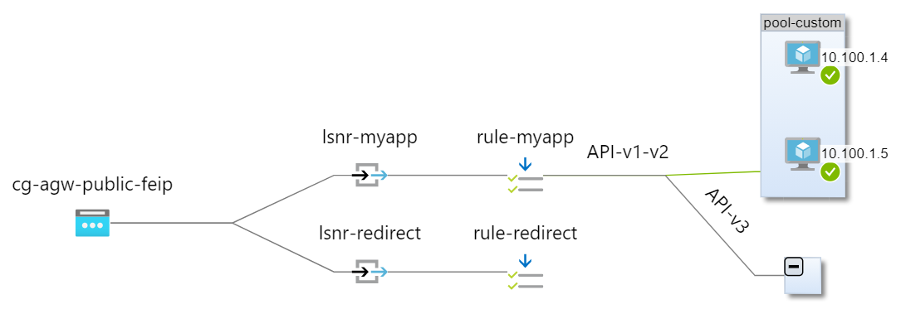
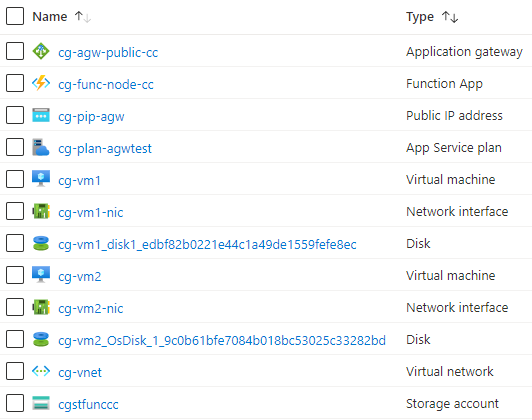

# Azure Terraform Lab - az-tfl-agw-advanced-01 - Advanced deployment of an Application Gateway

## Topology




## Resources created

This Lab creates the following Azure resources (tenant = 'cg'):




## Lab Learning 

* Deploy an Application Gateway as per the following:
 * 2 x multi-site listeners - one for serving web requests (port 80) and the other for redirect (port 8080 -> port 80)
 * 2 x Backend address pools - a default pool (Azure Function App with default homepage) and a custom pool (2 Linux VMs with Javascript/nodejs serving web requests)  
 * 2 x Health probes - one for the default pool and one for the custom pool
 * 2 x Backend HTTP Settings - one for each backend address pool
 * 2 x Redirects - one for web traffic to port 8080 and the other for web traffic containing the path "/v3/*"
 * 2 x Request Routing Rules - one for web traffic (PathBasedRouting) to port 80 and the other for redirect (Basic) from port 8080
 * 1 x URL Path Map - one path rule for mapping web traffic with path containing "/v1/*" or "/v2/*" to the custom pool and the other for mapping web traffic with path containing "/v3/*" to an external site (https://docs.readthedocs.io/en/stable/api/v3.html)


## Usage

- Authenticate with Azure (e.g. Azure CLI) and switch to the appropriate subscription (az account set -s <subscription>)
- Configure appropriate values for the variables in *terraform.tfvars*
- ```terraform init```
- ```terraform apply```
- Evaluate/Test/Demo
- ```terraform destroy```


## References

- [Microsoft](https://docs.microsoft.com/en-us/azure/application-gateway/)
- [Hashicorp](https://registry.terraform.io/providers/hashicorp/azurerm/latest/docs/resources/application_gateway)
