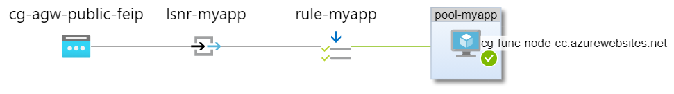
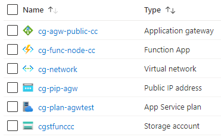

# Azure Terraform Lab - az-tfl-agw-basic - Basic deployment of an Application Gateway

## Topology




## Resources created

This Lab creates the following Azure resources (tenant = 'cg'):




## Lab Learning 

* Deploy a basic set up of an Application Gateway with an Azure Function app (default homepage) as the backend 
* Understand the basics of the Azure Application Gateway:
* * frontend IP configuration
* * single-site listener
* * backend pool
* * backend pool Http settings
* * probe
* * request routing rule


## Usage

- Authenticate with Azure (e.g. Azure CLI) and switch to the appropriate subscription (az account set -s <subscription>)
- Configure appropriate values for the variables in terraform.tfvars
- ```terraform init```
- ```terraform apply```
- Evaluate/Test/Demo
- ```terraform destroy```


## References

- [Microsoft](https://docs.microsoft.com/en-us/azure/application-gateway/)
- [Hashicorp](https://registry.terraform.io/providers/hashicorp/azurerm/latest/docs/resources/application_gateway)
