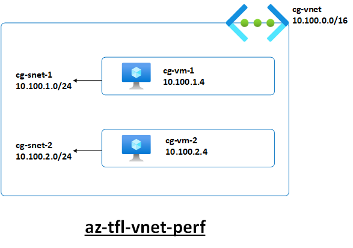
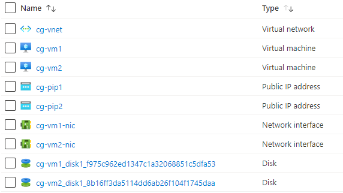

# Azure Terraform Lab - az-tfl-vnet-perf - Network Performance between VMs in a VNet

## Topology




## Resources created

This Lab creates the following Azure resources (prefix 'cg' used for names):




## Use-Cases

- Measure network performance (e.g. throughput, latency) between VMs (Oracle Linux) in the **same** VNet
- qperf is installed  and firewalld is disabled on both VMs 
- You may use ping, iperf3 or other network performance tools (may have to be installed)


## Usage

- Authenticate with Azure (e.g. Azure CLI) and switch to the appropriate subscription (az account set -s <subscription>)
- Configure appropriate values for the variables in terraform.tfvars
- ```terraform init```
- ```terraform apply```
- Evaluate/Test/Demo
- ```terraform destroy```


## Example - qperf

- On vm1, use qperf to listen

```sudo qperf```

- On vm2, use qperf to connect to vm1 (private IP) and test TCP bandwidth and latency for 10 seconds 

```sudo qperf <vm1 private IP> -t 10 tcp_bw tcp_lat```


## References

- [qperf](https://linux.die.net/man/1/qperf)
- [iperf3](https://iperf.fr/iperf-doc.php)
